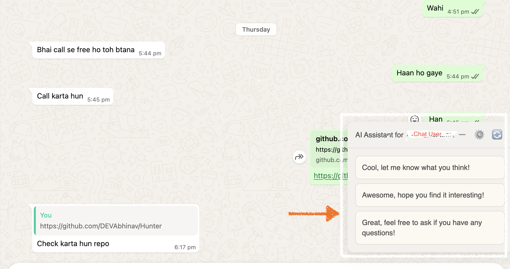
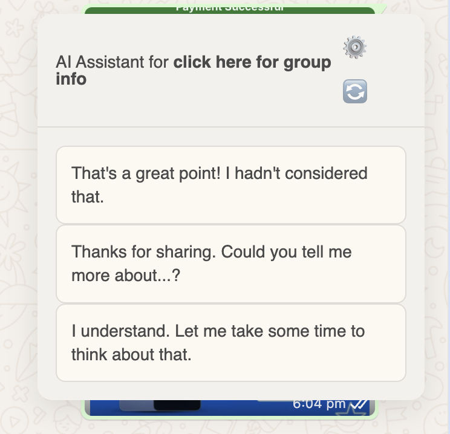

# Mindful AI Assistant for WhatsApp

**Your smart, context-aware AI assistant for WhatsApp. Get instant, high-quality reply suggestions powered by Google's Gemini models to help you communicate more effectively and mindfully.**

---

## 🚀 Supercharge Your WhatsApp Communication

Mindful AI Assistant is a powerful Chrome extension that acts as your personal **AI writer for WhatsApp**. It integrates seamlessly into the WhatsApp Web interface, analyzing chat context to provide you with smart, relevant, and customizable reply suggestions.

Whether you're struggling with writer's block, want to save time on frequent replies, or wish to communicate with more empathy and precision, this **WhatsApp Chat AI** is the tool for you.

## ✨ Key Features

-   **🤖 Context-Aware Suggestions:** The AI reads the recent chat history to provide relevant and coherent replies.
-   **✍️ Refine Your Drafts:** Write a quick draft, and let the AI refine it for tone, clarity, and impact.
-   **🧠 Custom AI Personality:** Define a unique communication strategy for each contact. Tell the AI to be "empathetic but firm," "professional and concise," or any other style you need. The extension remembers your preferences for each chat.
-   **🔧 Advanced Model Selection:** Choose from powerful Google AI models like **Gemini 2.5 Pro** and **Gemini 2.5 Flash** to balance between performance and cost.
-   **🔑 Use Your Own API Key:** For power users, the extension allows you to use your own Google AI API key for full control over your usage.
-   **🧘 Beautiful & Draggable UI:** A clean, intuitive, and movable interface that stays out of your way.

## 🤔 Why Choose Mindful AI Assistant?

-   **Overcome Writer's Block:** Never stare at a blank text box again. Get instant inspiration for any conversation.
-   **Save Time & Boost Productivity:** Spend less time thinking about what to write and more time getting things done.
-   **Communicate with Confidence:** Ensure your messages are clear, professional, and aligned with your intentions.
-   **Build Better Relationships:** Use empathetic and mindful language to foster stronger connections with your contacts.

## 📸 Screenshots

Here's a look at the Mindful AI Assistant in action.

| Full Context View                                                                            | Focused UI & Settings                                                                        |
| -------------------------------------------------------------------------------------------- | -------------------------------------------------------------------------------------------- |
| See how the assistant seamlessly integrates with your WhatsApp Web interface.                | The clean panel provides powerful suggestions, while the settings offer total customization. |
|                             |                                   |
|                                                                                              |                               |

## 🛠️ How to Install and Use

1.  **Download the Extension:** Get the extension from the Chrome Web Store (link coming soon) or load it manually.
2.  **Load Manually (for Developers):**
    *   Go to `chrome://extensions`.
    *   Enable "Developer mode".
    *   Click "Load unpacked" and select the project folder.
3.  **Open WhatsApp Web:** Navigate to `https://web.whatsapp.com/`.
4.  **Start Chatting:** The AI Assistant panel will appear. It will automatically detect new messages and provide suggestions.
5.  **Customize:** Click the `⚙️` icon to set custom strategies, choose your AI model, or add your API key.

## 🔑 SEO Keywords

**Primary:**
`WhatsApp AI Assistant`, `AI Reply for WhatsApp`, `WhatsApp Chat AI`, `Gemini WhatsApp Extension`, `AI Writer for WhatsApp`.

**Secondary:**
`AI-powered reply suggestions`, `Customizable AI for WhatsApp`, `Context-aware chat responses`, `Generate chat replies with AI`, `WhatsApp AI with Gemini Pro`, `AI chat assistant with custom instructions`.

**Problem/Solution:**
`Write better WhatsApp messages`, `Overcome writer's block`, `Save time replying`, `Empathetic AI communication`, `Professional WhatsApp replies`.

